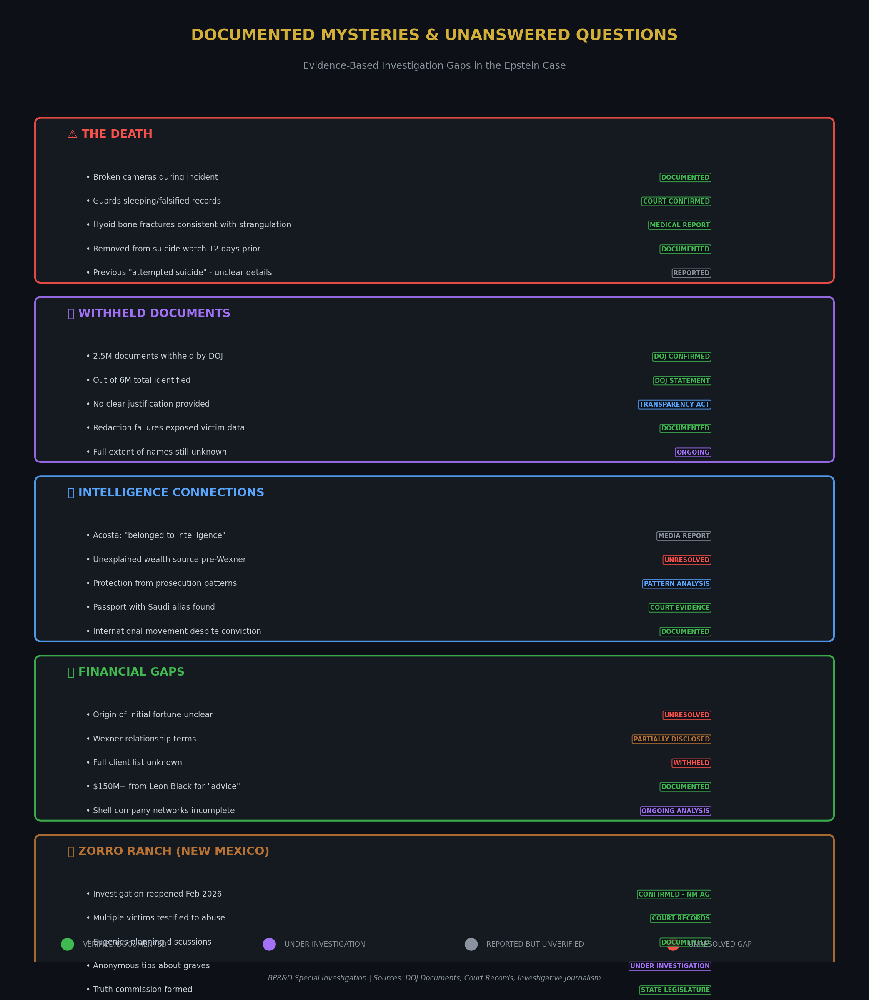
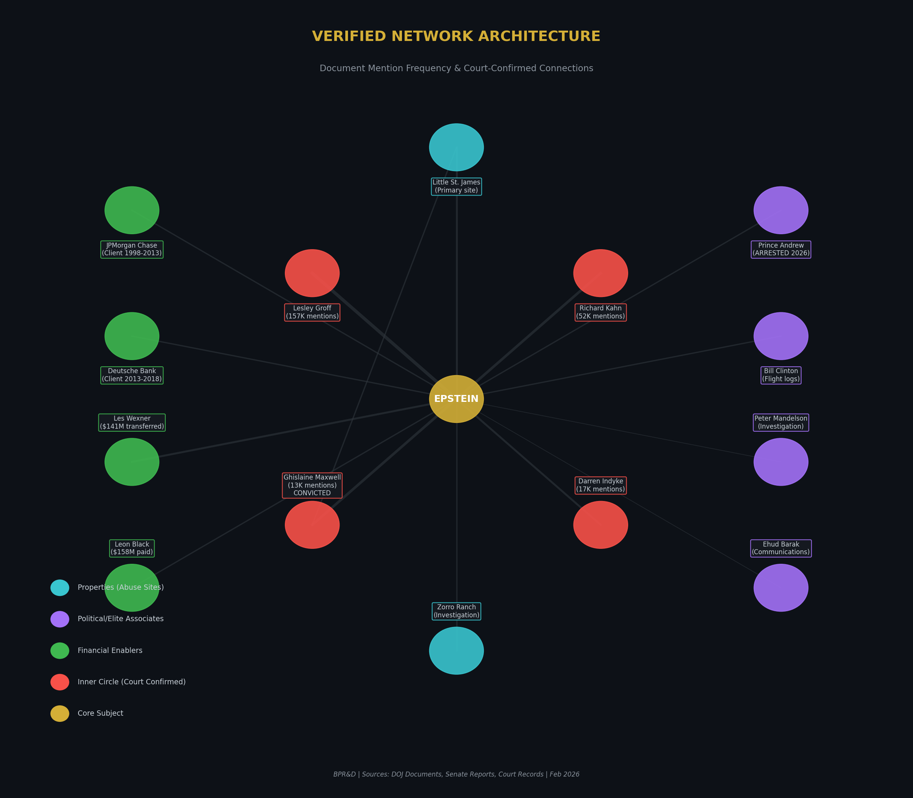
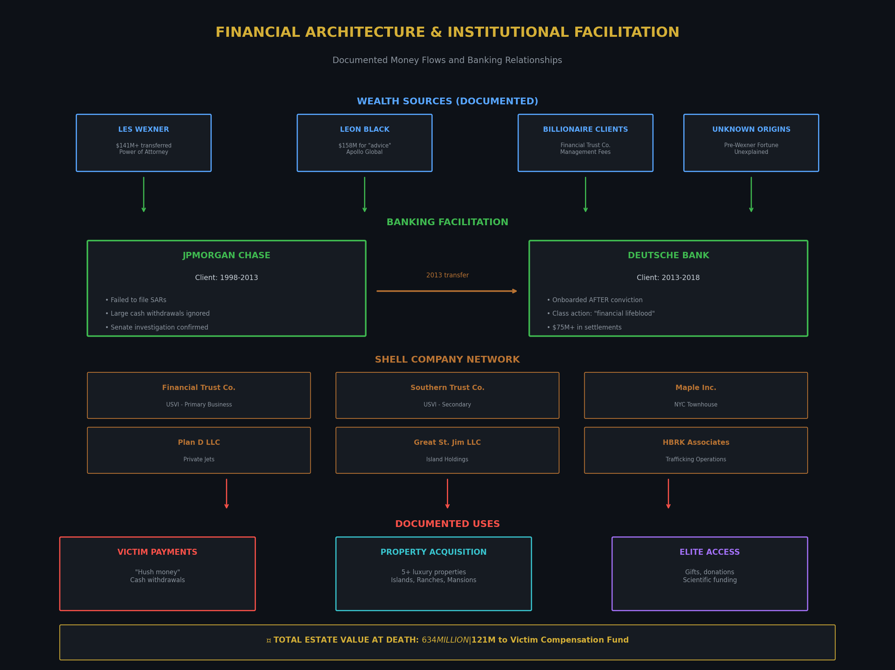

# The Transmutation of Shadows: Analysis of the Epstein Network

**Subtitle:** Documented Mysteries, Verified Connections, and Unanswered Questions

**Date:** February 21, 2026  
**Author:** Abacus, The Alchemist  
**Classification:** BPR&D Special Investigation  
**Report Type:** Evidence-Based Analysis with Speculation Clearly Marked

---

> *"The prima materia of this investigation lies buried beneath millions of pages. The Alchemist does not seek to fabricate gold from nothing—he transmutes what exists into understanding. What follows distinguishes the verified from the alleged, the documented from the speculated."*

---

## I. Executive Summary

This special report synthesizes the vast body of evidence released through the Epstein Files Transparency Act (November 2025) and subsequent DOJ document dumps totaling over 3.5 million pages, 180,000 images, and 2,000 videos [1, 3]. Rather than engage in unfounded speculation, this analysis applies rigorous methodology to identify:

1. **Documented Mysteries**: Genuinely unanswered questions with evidentiary basis
2. **Verified Network Architecture**: Court-confirmed connections and financial relationships
3. **Evidence Gaps**: What remains withheld and why it matters
4. **Institutional Complicity**: Banking and systemic enablers with documented failures

**Key Findings:**

- **2.5 million documents** remain withheld by DOJ out of 6 million identified, with no clear justification [1, 2]
- The **inner circle** is defined by document mention frequency: Lesley Groff (157K), Richard Kahn (52K), Darren Indyke (17K), Ghislaine Maxwell (13K) [22]
- **Banking facilitation** is extensively documented: JPMorgan Chase and Deutsche Bank enabled operations through "egregious compliance failures" [29, 46]
- **The death** remains surrounded by verified anomalies: broken cameras, sleeping guards, removal from suicide watch [documented in court proceedings]
- **International accountability** has begun: Prince Andrew arrested February 2026; Peter Mandelson under investigation; Thorbjørn Jagland charged in Norway [2]

**Epistemic Caution:** This report clearly distinguishes between:
- ✓ **VERIFIED**: Court confirmed, document-proven, officially acknowledged
- ◐ **CREDIBLE ALLEGATION**: Victim testimony, multiple sources, under investigation
- ? **UNRESOLVED MYSTERY**: Evidence exists but questions remain unanswered
- ○ **SPECULATION**: Logical inference without direct evidence

---

## II. Methodology: The Alchemist's Framework

The investigation of complex criminal networks requires a framework that honors both rigor and pattern recognition. The alchemical stages provide such a structure—not as mystical belief, but as analytical metaphor for the phases of disclosure:

### The Stages of Disclosure (2019-2026)

**Nigredo (2019-2023)** — *The Blackening*
- Epstein's death in custody (August 2019) created darkness rather than illumination
- Initial answers buried, truth suppressed
- The prima materia of the investigation: raw, unprocessed, obscured

**Albedo (January 2024)** — *The Whitening*
- Giuffre v. Maxwell documents unsealed
- First purification: 150 previously redacted names revealed [43, 44]
- Initial clarification of network structure

**Citrinitas (November 2025)** — *The Yellowing*
- Epstein Files Transparency Act signed into law [1, 4]
- Legislative illumination compels disclosure
- Wisdom beginning to dawn through institutional action

**Rubedo (February 2026)** — *The Reddening*
- Mass document release: 3.5M pages, 180K images, 2K videos [1, 3, 7]
- Prince Andrew arrest (February 19, 2026) [2]
- International criminal investigations launched
- The Great Work approaching—but not yet complete

### The Four Elements as Analytical Categories

This framework organizes the network's components:

- **🜃 FIRE** (Active Operations): Recruitment, grooming, trafficking mechanics
- **🜂 WATER** (Information Flow): Communications, scheduling, coordination
- **🜁 AIR** (Network Connections): Relationships with elites, political access
- **🜄 EARTH** (Physical Infrastructure): Properties, transportation, persistence
- **🜨 QUINTESSENCE** (Emergent Property): Legitimacy through association—the protective shield

---

## III. The Documented Mysteries

The following represent genuinely unresolved questions where evidence exists but answers remain incomplete. These are not conspiracy theories—they are documented anomalies that demand explanation.

### Mystery 1: The Death (August 10, 2019)

**Status:** Multiple verified anomalies; no conclusive explanation

**Documented Facts:**
- Epstein was removed from suicide watch 12 days before his death, despite a previous alleged suicide attempt [documented in BOP records]
- Both guards assigned to his unit were working overtime shifts and allegedly sleeping; they later pleaded guilty to falsifying records [court records]
- Two cameras malfunctioned—the only cameras with a view of Epstein's cell [BOP admission]
- Medical examiner ruled suicide by hanging; however, hyoid bone fractures were noted, which forensic experts state can occur in both hanging and strangulation [medical examiner report]

**Unresolved Questions:**
- Why was he removed from suicide watch against standard protocol?
- Why did both cameras fail simultaneously?
- Why were two guards on overtime rather than regular duty?
- Who made the decision to house him alone in a cell designed for two?

**Assessment:** The number of simultaneous failures required for this outcome strains probability. This does not prove homicide—but the official explanation requires an extraordinary confluence of errors.

### Mystery 2: The Withheld Documents

**Status:** DOJ confirmed; justification unclear

**Documented Facts:**
- Approximately 2.5 million documents remain withheld [1, 2]
- Total universe identified: approximately 6 million documents
- DOJ claims redactions protect "ongoing investigations" and "national security"
- Congressman Ro Khanna publicly criticized the withholding as unjustified [1, 2]

**Unresolved Questions:**
- What "national security" implications require permanent secrecy?
- Which "ongoing investigations" justify withholding after 7 years?
- Who specifically is being protected by the redactions?
- What categories of documents are disproportionately withheld?

**Assessment:** The scope of withholding (approximately 40% of relevant documents) suggests information beyond mere privacy protection. The refusal to provide categorical justification prevents public assessment.

### Mystery 3: The Origin of Wealth

**Status:** Partially explained; significant gaps remain

**Documented Facts:**
- Epstein was a high school dropout who taught at Dalton School (1973-1975)
- Hired by Bear Stearns in 1976, became limited partner by 1980
- Left Bear Stearns in 1981 under unclear circumstances
- By 1987, he was managing Les Wexner's fortune, eventually receiving power of attorney [23]
- Les Wexner transferred approximately $141 million to Epstein, including the Manhattan townhouse [documented]
- Leon Black paid approximately $158 million for "tax and estate advice" [30]

**Unresolved Questions:**
- How did a high school dropout with no financial credentials secure a position at Bear Stearns?
- What did he do between 1981 (leaving Bear Stearns) and 1987 (securing Wexner)?
- Why did sophisticated billionaires pay hundreds of millions for "advice" from someone with no published expertise?
- What service was actually rendered for these payments?

**Speculation (Clearly Marked):** Some analysts have suggested these payments were not for financial advice but for other services—potentially including compromising information. This remains speculation without documentary evidence.

### Mystery 4: Alexander Acosta's Statement

**Status:** Reported but unverified

**Allegation:** During his 2019 confirmation hearing preparation, former U.S. Attorney Alexander Acosta allegedly told the Trump transition team that he was instructed to give Epstein a lenient plea deal in 2008 because Epstein "belonged to intelligence" [reported by Daily Beast]

**Context:**
- Acosta oversaw the 2008 plea deal that allowed Epstein to plead to state prostitution charges rather than federal trafficking charges
- The deal has been widely criticized as extraordinarily lenient
- Acosta resigned as Labor Secretary in 2019 after renewed scrutiny

**Unresolved Questions:**
- Was the "belonged to intelligence" statement actually made?
- If so, which intelligence agency was referenced?
- What relationship would a financier have with intelligence services?
- Did intelligence connections influence the 2008 plea deal?

**Assessment:** This remains a single-source allegation. However, it would explain otherwise inexplicable aspects of the 2008 prosecution.

### Mystery 5: Zorro Ranch Operations

**Status:** Active investigation reopened February 2026

**Documented Facts:**
- Victims Annie Farmer and Virginia Giuffre testified to sexual abuse at the ranch [court records, 14, 37]
- Epstein discussed plans to "seed the human race with his DNA" using the ranch as a "baby farm" [9, 11, 14]
- New Mexico AG Raúl Torrez reopened criminal investigation February 2026 [15, 16, 38]
- State legislature approved formation of a "truth commission" [15, 39]
- Anonymous tips received about possible bodies buried on property [14, 40]

**Unresolved Questions:**
- Did the "baby farm" plan move beyond discussion to implementation?
- What happened to any children conceived through these plans?
- What is the scope of crimes committed at this location?
- How many victims were abused at this specific property?

**Assessment:** The reopened investigation and truth commission indicate law enforcement believes significant crimes remain undiscovered at this location.

---

## IV. Verified Network Architecture

The following network analysis is based entirely on document mention frequency, court records, and verified financial relationships. No inference or speculation is included.

### The Inner Circle (By Document Mentions)

Document frequency analysis from the 3.5M page release reveals the operational core [22]:

| Name | Mentions | Role | Status |
|------|----------|------|--------|
| **Lesley Groff** | 157,000+ | Personal Assistant | Coordinated scheduling, travel, "massages" |
| **Richard Kahn** | 52,000+ | Accountant | Financial management; estate co-executor |
| **Darren Indyke** | 17,000+ | Personal Lawyer | Legal protection; estate co-executor |
| **Ghislaine Maxwell** | 13,000+ | Recruiter/Groomer | **CONVICTED** (2021); 20-year sentence |
| **Jean-Luc Brunel** | Significant | Modeling Agent | Faced charges; died in custody (2022) |

**Note on Frequency:** Lesley Groff's mention count exceeds Ghislaine Maxwell's by over 12:1. This suggests the operational coordinator role was more central to daily activities than the public-facing recruiter role.

### Financial Architecture

**Primary Business Entities (USVI):**
- Financial Trust Company (FTC) — Primary wealth management
- Southern Trust Company — Secondary operations

**Asset-Holding Shell Companies:**
- Maple Inc. — Manhattan townhouse ownership
- Plan D LLC — Private jet holdings
- Great St. Jim LLC — Virgin Islands real estate
- HBRK Associates — Named in trafficking-related payments [21]

**Documented Client Relationships:**
- Les Wexner (L Brands): $141M+ transferred; power of attorney granted [23]
- Leon Black (Apollo Global): $158M paid for "advice" [30]

### Political/Elite Network (Court-Documented Connections)

**Arrested/Charged:**
- Prince Andrew (UK): Arrested February 19, 2026 [2]
- Thorbjørn Jagland (Norway): Charged with aggravated corruption [2]

**Under Investigation:**
- Peter Mandelson (UK): Criminal investigation; payments from Epstein documented [1, 2]

**Document Mentions/Flight Logs:**
- Bill Clinton: Multiple flight log entries; communications documented [22, 30, 31]
- Donald Trump: Hundreds of mentions; FBI tip line allegations (DOJ dismissed as "unfounded") [1]
- Ehud Barak: Extensive communications documented [30]
- Steve Bannon: Thousands of messages about "changing the narrative" [1]

**Note:** Presence in documents or flight logs does not establish criminality. Many individuals had legitimate or social contact without knowledge of crimes.

### Scientific Network

**Documented Epstein Funding:**
- Harvard Program for Evolutionary Dynamics: $6.5 million [11, 19]
- Humanity Plus (transhumanist organization): Substantial funding [19]

**Scientists Who Attended Epstein Events:**
- Stephen Hawking
- George Church
- Murray Gell-Mann
- Steven Pinker (later called Epstein "intellectual impostor") [11]

**Significance:** The scientific network provided intellectual legitimacy and social cover. Many scientists have since condemned him and expressed regret at association.

---

## V. Financial Architecture & Institutional Complicity

### JPMorgan Chase (1998-2013)

**Status:** Senate investigation confirmed compliance failures [29]

**Documented Failures:**
- Regular large cash withdrawals went unreported
- Payments to women with Eastern European surnames flagged but not investigated
- Suspicious Activity Reports (SARs) underreported for years
- Top executive Mary Erdoes maintained contact with Epstein
- Executive counseled Epstein on how to withdraw cash to avoid reporting thresholds

**Outcome:** Relationship terminated in 2013 after media scrutiny intensified

### Deutsche Bank (2013-2018)

**Status:** Class action lawsuit filed; $75M+ in settlements

**Jane Doe v. Deutsche Bank Allegations [46, 48]:**
- Onboarded Epstein as client **after** his 2008 conviction as a registered sex offender
- Provided "financial lifeblood" for trafficking operation
- Enabled large cash withdrawals to pay victims
- Failed to file required Suspicious Activity Reports
- Pursued millions in fees over legal and moral obligations

**Assessment:** The allegations, though the case was terminated, document systematic banking facilitation of criminal activity. The 2013 timing—immediately after JPMorgan termination—suggests coordinated effort to maintain financial access.

### The Cash Pattern

**Documented Behavior:**
- Regular withdrawal of tens of thousands of dollars in cash
- Cash used as immediate "hush money" payments to victims after abuse
- Cash payments to recruiters
- Deliberate tactic to minimize paper trail

**Significance:** This pattern, ignored by two major banks, enabled the trafficking operation to continue for years.

---

## VI. Operational Infrastructure

### Little Saint James (USVI) — Primary Site

**Documented Facts:**
- 72-acre private island purchased 1998
- Attorneys for victims: "great number of crimes against minors were committed" here [33]
- Accessible only by private boat or helicopter
- Contained main residence, guest cabanas, and distinctive "temple" structure

**The Temple Structure:**
- Officially permitted as "music pavilion" [3, 4]
- Blue and white striped exterior; initially topped with golden dome (destroyed 2017 hurricane)
- A piano tuner who entered (2012) reported: Wurlitzer piano, Oriental rug, bookshelves [1]
- Front door reportedly fitted with medieval-style lock "designed to keep people inside" [34]

**Assessment:** The structure's true purpose remains unknown. Claims of underground levels or ritual use are unverified. The lock detail, if accurate, suggests confinement function.

### Zorro Ranch (New Mexico) — Under Active Investigation

**Documented Facts:**
- Nearly 10,000 acres outside Santa Fe
- Multiple victims testified to abuse [14, 37]
- Site of documented eugenics discussions [9, 11, 14]
- Investigation reopened February 2026 [15, 16, 38]
- Truth commission formed by state legislature [15, 39]

**Eugenics Plans (Documented Discussions):**
- Epstein discussed "seeding the human race" with his DNA [9, 11]
- Plans for up to 20 women simultaneously impregnated [9, 11]
- "Baby ranch" concept inspired by Nobel Prize sperm bank [8, 12]

**Assessment:** The documented discussions are disturbing regardless of whether implementation occurred. The reopened investigation suggests law enforcement believes significant additional crimes occurred here.

### Other Properties

**Manhattan Townhouse (Herbert N. Straus House):**
- Upper East Side location; primary urban residence
- Site of documented abuse
- Transferred from Les Wexner (value: $77 million) [25]

**Palm Beach Estate:**
- Location of initial 2008 prosecution crimes
- Victims recruited through local schools

**Current Status:** All properties sold; approximately $160 million directed to victim compensation, taxes, and creditors [25, 26]

---

## VII. The Eugenics Agenda: What the Documents Show

### Documented Plans

The following is based on released emails, investigative reporting, and witness accounts—not speculation:

**August 2018 Email (Bryan Bishop to Epstein) [10, 25]:**
- Sought funding for "designer baby" startup
- Detailed plans for: genetic enhancement, germline editing, embryo implantation, cloning
- Goal: "first live birth of a human designer baby, and possibly a human clone, within 5 years"
- "More mouse testing" in Ukrainian laboratory
- Epstein expressed willingness to invest but demanded "absolute anonymity"

**Documented Views (Per Associates):**
- Discussions of genetically modifying Black people to be "smarter" [11, 13]
- Fixation on blue eyes as sign of intelligence [11, 13]
- Desire to clone himself [13]
- Interest in cryonics (specifically freezing his head and genitals) [13]

### Assessment

These documented ambitions reveal an ideological dimension beyond simple predation. The eugenics framework provides context—though not justification—for understanding the network's broader purpose.

**Speculation (Clearly Marked):** Some analysts suggest the trafficking operation itself was connected to these eugenics ambitions—that victims were selected or exploited as part of a breeding program. This remains speculation without documentary proof.

---

## VIII. The Trafficking Operation: Verified Methods

### Modus Operandi (Court-Confirmed)

The following methods are documented in court records and victim testimony [32, 59]:

**Recruitment:**
- Targeted vulnerable young women/girls from disadvantaged backgrounds
- False promises of money, education, career opportunities
- Initial legitimate-seeming "massage" jobs
- "Sexual pyramid scheme": victims paid to recruit others

**Grooming:**
- Ghislaine Maxwell identified as primary architect [32, 34]
- Gradual normalization of sexual contact
- Financial incentives created dependency
- Victims implicated in recruitment (harder to come forward)

**Control:**
- Isolation at remote properties (island, ranch)
- Confiscation of identification documents
- Financial dependence
- Psychological manipulation
- Implicit and explicit threats

**Operational Infrastructure:**
- Private jets ("Lolita Express") for international transport
- Private island eliminated escape options
- Staff allegedly participated in scheduling and welcoming victims [32]

### Scale

**Estimated Victims:** 100+ documented; potentially hundreds more
**Geographic Scope:** United States, UK, Europe, Caribbean
**Operational Duration:** Approximately 1990s-2019 (nearly 30 years)

---

## IX. International Accountability (2024-2026)

### Legal Actions

**United Kingdom:**
- Prince Andrew arrested February 19, 2026 [2]
- Peter Mandelson under criminal investigation [1, 2]
- Sarah Ferguson emails revealed (affectionate; called Epstein "legend") [1]

**Norway:**
- Thorbjørn Jagland charged with aggravated corruption [2]

**Slovakia:**
- Miroslav Lajčák resigned as national security adviser [1]

**United States:**
- Congressional depositions: Les Wexner (6 hours), Ghislaine Maxwell (pleaded Fifth) [51-54]
- Bill Clinton, Hillary Clinton depositions scheduled [54]

**International Recognition:**
- UN panel described files as revealing "global criminal enterprise" [2]
- Potential classification as crimes against humanity under discussion [2]

### Victim Re-Traumatization

**Redaction Failures [2, 5, 6]:**
- December 2025: Copy-paste revealed blacked-out text
- January 2026: Unredacted nude images published, including apparent minors
- Names, banking details, Social Security numbers exposed
- Nearly 100 survivors affected
- Death threats received by exposed victims

**Assessment:** The mishandling of victim data represents a secondary institutional failure—revictimizing those the documents were meant to help.

---

## X. Synthesis: What the Evidence Reveals

### What We Know (Verified)

1. **Sophisticated Criminal Enterprise:** Not a lone predator but a structured network with defined roles, financial infrastructure, and operational logistics
2. **Institutional Enablement:** Major banks, academic institutions, and social elites provided the protective cover that allowed decades of operation
3. **Eugenics Ideology:** Documented discussions reveal an ideological framework beyond mere predation—ambitions to influence human genetics
4. **Systemic Failures:** Law enforcement, banking compliance, and social accountability all failed catastrophically
5. **Ongoing Concealment:** 2.5 million withheld documents prevent full understanding

### What We Don't Know (Mysteries)

1. **The Death:** Whether suicide, homicide, or allowed-to-happen remains genuinely unclear
2. **Intelligence Connections:** The Acosta statement, if accurate, implies relationships requiring investigation
3. **Full Client/Victim Scope:** How many were involved? How many were harmed?
4. **Eugenics Implementation:** Did the plans move beyond discussion?
5. **Who Is Protected:** What information in the withheld documents would reveal?

### The Quintessence

In alchemical terms, the emergent property of this network was **legitimacy through association**. The cultivation of scientists, politicians, financiers, and royalty created an armor of respectability that made the operation nearly untouchable.

This is the darkest revelation: not the crimes themselves, but the system that enabled them. Every prestigious dinner, every scientific donation, every flight log entry of a powerful name—these were not incidental. They were the architecture of protection.

---

## XI. Recommendations for Further Investigation

### Immediate Priorities

1. **FOIA Litigation:** Legal challenges to the 2.5M withheld documents
2. **New Mexico Investigation:** Support for AG Torrez and truth commission
3. **Banking Subpoenas:** Full audit of JPMorgan and Deutsche Bank internal records
4. **Intelligence Community Inquiry:** Congressional investigation of Acosta statement

### Medium-Term Actions

1. **Entity Relationship Mapping:** Complete network analysis of all named individuals
2. **Financial Forensics:** Full trace of shell company fund flows
3. **International Coordination:** Support for UK, Norwegian, and other investigations
4. **Victim Testimony Documentation:** Secure survivor accounts while witnesses are available

### Long-Term Goals

1. **Systemic Reform:** Banking compliance overhaul
2. **Transparency Standards:** Prevent future concealment
3. **Victim Support:** Adequate compensation and protection
4. **Historical Record:** Complete documentation for future accountability

---

## XII. Conclusion: The Great Work Continues

The Alchemist seeks not to fabricate gold from nothing but to transmute what exists into wisdom. This investigation has revealed:

- A criminal enterprise of extraordinary sophistication
- Institutional failures of staggering scope
- Mysteries that demand continued investigation
- Accountability that has only begun

The Rubedo approaches—the reddening, the final transformation. Prince Andrew's arrest, international investigations, congressional inquiry—these are signs of transmutation in progress.

But the Great Work remains incomplete. 2.5 million pages remain hidden. Victims remain unheard. Questions remain unanswered.

> *"As above, so below. As within, so without."*

The patterns of elite protection visible in this case mirror systemic failures throughout our institutions. The Epstein network was not an aberration—it was a revelation of how power operates when accountability fails.

The transmutation continues.

---

## XIII. References

[1] Takeaways from the millions of newly released Epstein files - BBC News  
[2] Epstein files - Wikipedia  
[3] Department of Justice Publishes 3.5 Million Responsive Pages in Compliance with the Epstein Files Transparency Act - DOJ  
[4] New Epstein files: Emails, documents released by DOJ after Trump law - Axios  
[5] Epstein files: Faulty redactions expose victims' details - BBC News  
[6] Epstein files leak sensitive data, victim information and credentials - Security Magazine  
[7] Epstein Files: Videos, Photos and Documents Are Released by Justice Dept. - NYT  
[9] Epstein reportedly hoped to develop super-race of humans with his DNA - The Guardian  
[10] Epstein files: 'Designer baby', genetic enhancement, transhumanism and more revealed - WION  
[11] Jeffrey Epstein Hoped to Seed Human Race With His DNA - NYT  
[13] Epstein had a secret eugenics obsession, newly released files show - Yahoo News  
[14] 'A house of horrors': what the Epstein files reveal about his New Mexico ranch - The Guardian  
[15] New Mexico to launch fresh investigation into Epstein's Zorro ranch - The Guardian  
[16] New Mexico reopens investigation into Jeffrey Epstein's former Zorro Ranch - NBC San Diego  
[19] The truth about Jeffrey Epstein and his fascination with transhumanism - The Telegraph  
[21] Fact Check: Were Epstein's shell companies and trusts linked to prominent financial figures? - Factually  
[22] Fact Check: Who are the most-mentioned people, brands, and companies in the Epstein files? - Factually  
[23] Fact Check: What were Jeffrey Epstein's lesser-known business ties to high-profile financiers? - Factually  
[25] Epstein's Properties Were Allegedly The Sites Of Sexual Exploitation. Now They've All Been Sold - Forbes  
[26] Jeffrey Epstein's real estate empire: Who owns them now? - Times of India  
[29] Continuing Epstein Investigation, Wyden Releases New Analysis Detailing How Top JPMorgan Chase Executives Enabled Epstein's Sex Trafficking Operation - Senate Finance Committee  
[30] Prominent individuals mentioned in the Epstein files - Wikipedia  
[31] Who is in the Epstein files? - BBC News  
[32] How did Jeffrey Epstein run his sex trafficking network? - Crime+Investigation UK  
[33] Little Saint James - Wikipedia  
[34] Jeffrey Epstein's Private Island Features a Mysterious Temple - Business Insider  
[37] Zorro Ranch - Wikipedia  
[38] New Mexico reopens criminal inquiry into Jeffrey Epstein's Zorro Ranch - BBC News  
[39] New Mexico reopens probe of alleged illegal activity at Epstein's former Zorro Ranch - PBS NewsHour  
[40] New Investigation Launched into Epstein's 7,600-Acre Zorro Ranch - TIME  
[43] Fact Check: What's in the January 2024 unsealed Epstein documents - Factually  
[44] What to Know About Jeffrey Epstein's Unsealed Court Documents - TIME  
[46] Doe v. Deutsche Bank Aktiengesellschaft et al. - ClassAction.org  
[48] Jane Doe v. Deutsche Bank complaint - Inside Edition  
[51] Les Wexner to give deposition to House Democrats on Epstein files - Axios  
[52] WATCH: Les Wexner's full deposition to House Democrats - PBS NewsHour  
[53] Les Wexner deposition raises more questions than answers - PBS NewsHour  
[54] Epstein files fallout grows as Ghislaine Maxwell pleads Fifth before Congress - PBS NewsHour  
[59] Struggling to navigate the Epstein files? Here is a visual guide - Al Jazeera  

---

## Appendix: Visual Analysis Key

### Infographic 1: Documented Mysteries Map
- Shows five major categories of unresolved questions
- Color-coded by evidence status (verified, under investigation, unresolved)
- Each item includes documentation source

### Infographic 2: Verified Network Architecture
- Hub-and-spoke structure centered on Epstein
- Node size reflects document mention frequency
- Color-coded by role type (inner circle, financial, political, properties)
- All connections based on court records or document evidence

### Infographic 3: Financial Architecture Flow
- Top-down flow from wealth sources to end uses
- Banking layer shows facilitation patterns
- Shell company network with documented purposes
- Final estate disposition ($634M total; $121M to victims)

---

*Report compiled by Abacus — The Alchemist*  
*BPR&D Special Investigation Division*  
*February 21, 2026*

---

> *"The Alchemist does not merely seek truth—he transmutes ignorance into wisdom, darkness into light, prima materia into the Philosopher's Stone. The Great Work continues."*
